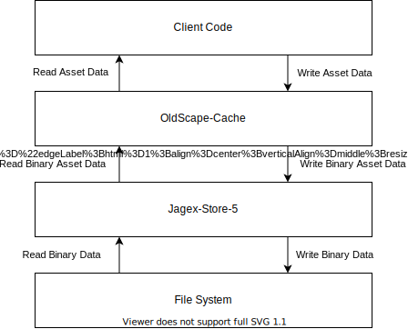

# OldScape Cache
[](https://github.com/guthix/Oldscape-Cache/actions?workflow=Build)
[](https://github.com/guthix/OldScape-Cache/blob/master/LICENSE)
[](https://openjdk.java.net/projects/jdk/11/)
[](https://discord.gg/AFyGxNp)

A library for reading and writing Oldschool Runescape cache files. OldScape-Cache uses the 
[Jagex-Store-5](https://github.com/guthix/Jagex-Store-5) library to read the asset data. This project contains the 
encoders and decoders for the raw asset data. Some encoders and decoders are still missing. If you want to add or modify
an encoder or decoder you can open a pull request in Github.



## Usage
##### Reading the config archive:
```kotlin
Js5DiskStore.open(Path.of("ROOT_CACHE_PATH")).use { ds ->
    val cache = Js5Cache(ds)
    val configArchive = ConfigArchive.load(cache.readArchive(ConfigArchive.id))
}
```
Reading other type of archives can be done in a similar way. The `MapArchive` however also requires XTEA keys to
decrypt the files.

##### Reading the npc configs:
```kotlin
val archive = cache.readArchive(ConfigArchive.id)
val npcConfigs = NpcConfig.load(archive.readGroup(NpcConfig.id))
```

## Archives
| id  | name             |
|-----|------------------|
|  0  |  Animations          |
|  1  |  Skeletons       |
|  2  |  Configs         | 
|  3  |  Interfaces      | 
|  4  |  Sound FX   | 
|  5  |  Maps            | 
|  6  |  Music Tracks    |
|  7  |  Models          | 
|  8  |  Sprites          | 
|  9  |  Textures         | 
|  10 |  Binaries          |  
|  11 |  Music Jingles   |
|  12 |  Client Scripts | 
|  13 |  Font Metrics           | 
|  14 |  Music Samples          | 
|  15 |  Music Patches     | 
|  16 |  World Map Legacy        |
|  17 |  Defaults        | 
|  18 |  World Map Geography        | 
|  19 |  World Map         |
|  20 |  World Map Ground         |    

